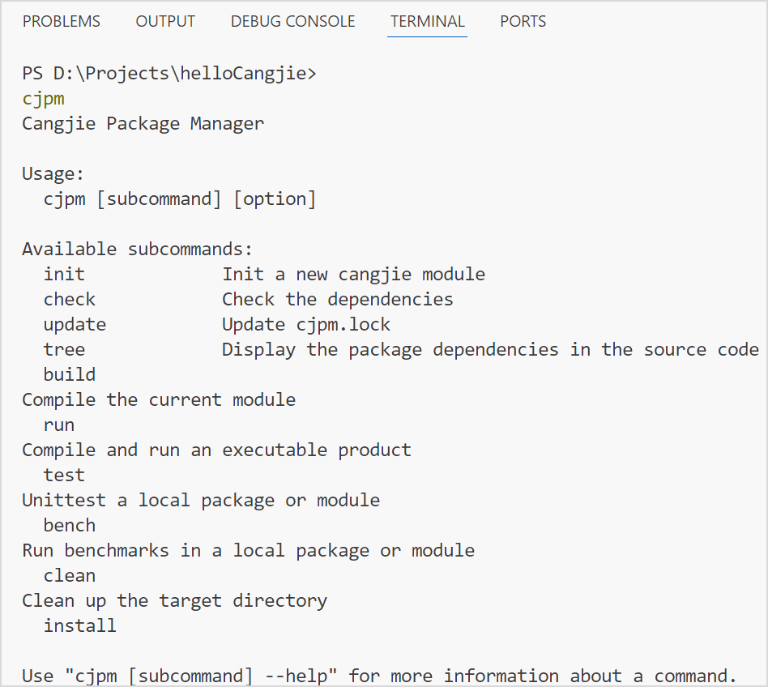

# 编译构建

> **说明：**
> 
> 本文档部分图片截取于 VSCode 软件界面，仅用于说明仓颉插件在 VSCode 中的使用方法。

VSCode 中可视化方式提供的仓颉功能编译构建能力依赖 cjpm 工具，该工具要求打开的仓颉工程的模块内必须包含规范的 `cjpm.toml` 文件。若没有该文件，仍想执行工程的编译构建，可在终端使用 cjc 命令。

在 VSCode 中提供在命令面板执行命令、在终端进行执行命令、单击运行按钮运行工程，以及单击锤子按钮编译工程四种方式，来实现仓颉工程的编译构建。

## 编译构建方式

### 在命令面板执行命令

在 VSCode 中使用快捷键 F1，或同时按下 Ctrl + Shift + P（macOS 系统为 Command + Shift + P）打开命令面板，输入分类词 Cangjie 来快速找到以下编译相关命令。

  * 选择 `Cangjie: Parallelled Build` 选项执行并行编译。

执行并行编译后，在工程文件夹下会生成 `target` 目录，`target` 目录下有一个 `release` 文件夹，`release` 文件夹下包含三个目录：`.build-logs` 目录、`bin` 目录，以及工程名同名的目录。`bin` 目录下存放可执行文件（可执行文件只有在 `cjpm.toml` 的 `output-type` 为 `executable` 时才会生成），工程名同名目录下存放编译的中间产物。

在 output Panel 上会打印编译是否成功的信息。

  * 选择 `Cangjie: Build With Verbose` 选项执行编译并展示编译日志。

该编译参数除了执行编译外，还会打印编译日志。

  * 选择 `Cangjie: Build With Debug` 选项生成 debug 版本的目标文件。

该命令的编译结果中带有 debug 信息，供调试使用。

  * 选择 `Cangjie: Build With Coverage` 选项生成覆盖率信息。

该命令在编译结果中带有覆盖率信息。

  * 选择 `Cangjie: Build With Alias` 执行编译并指定输出可执行文件的名称。

执行该命令，按下回车键后，会弹出一个输入栏，需要开发者为工程的编译结果赋予一个新的名字。该命令只对 `cjpm.toml` 的 `output-type` 为 `executable` 时有效。

  * 选择 `Cangjie: Build With Increment` 选项执行增量编译。

用来指定增量编译。

  * 选择 `Cangjie: Build With CustomizedOption` 选项按条件透传 `cjpm.toml` 中的命令。

使用该选项需要先在 `cjpm.toml` 中配置 `customized-option` 字段。然后在命令面板输入 `Build With CustomizedOption`，按下回车键后可以选择需要的参数，参数可以多选，选择后按下回车键即可。

若没有在 `cjpm.toml` 中配置 `customized-option` 字段，并执行了该条命令，插件会提示开发者先配置改字段。

  * 选择 `Cangjie: Build With TargetDir` 选项执行编译并在指定路径生成编译产物。

选择该命令执行后，可指定编译产物的输出路径，默认不作输入操作则以 `cjpm.toml` 中的 `target-dir` 字段为路径。

当输入的编译产物路径与 cjpm.toml 中的 `target-dir` 字段不同时，会弹出提示是否覆盖 cjpm.toml 中的 `target-dir` 字段。若选择 Yes 覆盖，则会将 cjpm.toml 中 `target-dir` 字段覆盖成输入的值。

该命令执行成功后，会在指定的路径下生成编译产物。

  * 选择 `Cangjie: Build With Jobs` 选项，执行编译前自定义最大并发度。

支持通过执行该命令在编译之前自定义最大并发度，输入参数为任意数字，设置范围为 \(0, CPU 核数 \* 2\]。

当在输入框输入非数字时，会终止操作，并提示开发者输入数字内容：“Invaild input\! The input should be number.”

当在输入框输入的范围超出所支持的范围 \(0, CPU 核数 \* 2\] 时，会默认采用 CPU 核数，并提示超出可选范围的告警信息。

  * 选择 `Cangjie: Build With CodeCheck` 选项，执行编译时进行 CodeCheck 静态代码检查。

执行该命令编译工程时，会对当前工程进行 CodeCheck 静态代码检查，如果检查到【要求】级别的代码规范违规，则编译失败，检查到【建议】级别的违规仅告警，正常完成编译。

  * 选择 `Cangjie: Build With MultiParameter` 选项执行多参数编译。

仓颉工程的编译可以叠加多个参数，在命令面板搜索到 `Build With MultiParameter` 命令后，选择需要叠加的参数，其中 `--target` 参数会根据 `cjpm.toml` 中的 `target` 字段的设置来决定是否显示。如果开发者没有配置 `target` 的内容，则 `--target` 参数选项会隐藏；`--<customized-option>` 参数会根据 cjpm.toml 中的 `customized-option` 字段的设置来决定是否显示，如果开发者没有配置 `customized-option` 的内容，则 `--<customized-option>` 参数选项会隐藏。

勾选想叠加的参数，按下回车键或者单击 ok 按钮。也可单击界面中的向左箭头，重新选择编译参数。

如果叠加的参数中选择了 `cjpm build --output=<name>`，那么需要输入一个别名字符串，然后按下回车键执行叠加命令操作。

如果叠加参数中选择了 `cjpm build --target=<name>`，那么可以选择一个想要交叉编译的平台。

如果叠加参数中选择了 `cjpm build --<customized-option>`，那么可以选择透传参数。

叠加命令的编译结果就是这些命令分别执行的总和。

  * 选择 `Cangjie: Update Cjpm.toml` 选项更新 cjpm.lock 文件。

在修改完 `cjpm.toml` 文件后，需要执行该命令，更新 `cjpm.lock` 文件。如果是通过 UI 界面修改的 `cjpm.toml` 文件，则不需要手动执行该操作。

  * 选择 `Cangjie: Execute Test File` 选项编译单元测试产物，执行对应的单元测试用例，并直接打印测试结果。

  * 选择 `Cangjie: Test With NoRun` 选项编译对应测试产物。

  * 选择 `Cangjie: Test With SkipBuild` 选项测试产物存在的前提下，用于执行对应测试产物。

  * 选择 `Cangjie: Test With Jobs` 选项执行单元测试之前自定义最大并发度，操作与 `Build With Jobs` 相同。

  * 选择 `Cangjie: Test With MultiParameter` 选项执行多参数执行仓颉工程的单元测试。

在选择该条命令后，可以选择指定包路径、模块或者成员执行单元测试。只有打开工作空间，才显示成员选择选项。

如果选择 `Specify the test paths` 选项，则可以输入指定待测试的包路径。若不需要指定，则直接按 Enter 键。

此步骤可通过输入多个包的路径并用空格分隔，可以实现多包并发单元测试。

如果选择 `Specify the test modules` 选项，则可以输入指定待测试的模块。若不需要指定，则直接按 Enter 键。

此步骤可通过输入多个模块并用空格分隔，可以实现多模块单元测试。

如果选择 `Specify a test member` 选项，则可以输入指定待测试的成员。若不需要指定，则直接按 Enter 键。

选择要叠加的参数。

如果选择了 `--filter=<value>` 参数，则需要输入对应的过滤测试子集的表达式。

输入过滤测试子集的表达式后，可以执行 `cjpm test` 的完整命令。执行结果会在 Output 面板输出。

如果在 cjpm.toml 中配置了 `target` 和 `customized-option`，则可以选择的参数有 `--target=<name>` 和 `--<customized-option>`。

如果选择了 `--target=<name>` 参数，则需要选择对应的平台。

如果选择了 `--<customized-option>` 参数，则需要选择条件选项。

  * 选择 `Cangjie: Clean Build Result` 选项清除编译结果（工程目录下的 build 目录）。

  * 选择 `Cangjie: Check Circular Dependencies` 选项检测文件依赖。

  * 选择 `Cangjie: Edit Configuration (UI)` 选项打开 UI 配置界面。

  * 选择 `Cangjie: Install With Verbose` 选项展示安装日志。

  * 选择 `Cangjie: Install With Debug` 选项生成 debug 版本的安装产物。

  * 选择 `Cangjie: Install With RootPath` 选项指定可执行文件的安装路径。

在选择该条命令后，在弹出的输入框中输入期望可执行文件的安装路径，最终会将可执行文件安装到输入的自定义路径中。不配置时，Linux 系统和 macOS 系统下默认为 `$HOME/.cjpm`，Windows 系统下默认为 `%USERPROFILE%/.cjpm`。

  * 选择 `Cangjie: Install With TargetDir` 选项指定编译产物的存放路径。

安装可执行文件前会先进行编译，选择该条命令后，在弹出的输入框中输入期望编译产物的存放路径，最终会将编译产物安装到输入的自定义路径中。

  * 选择 `Cangjie: Install With Alias` 选项指定最终安装的产物名。

选择该条命令后，在弹出的输入框中输入期望安装产物的名字。

  * 选择 `Cangjie: Install With Git` 选项安装远端 git 代码仓产物。

选择该条命令后，在弹出的输入框中输入远端 git url。

输入远端 git url 后，键入回车可进一步选择关于远端 git 代码仓的分支、tag 或 commit 信息。

选择自定义代码仓 branch / tag / commit 号选项，在弹出框内输入 branch / tag / commit 号信息，即可安装远端 git 代码仓产物。

  * 选择 `Cangjie: Install With List` 选项打印已安装产物列表。

  * 选择 `Cangjie: Install With SkipBuild` 选项跳过编译阶段以直接安装产物，需要项目处于编译完成状态。

  * 选择 `Cangjie: Install With Jobs` 选项指定并行编译的最大并发数。

选择该条命令后，在弹出的输入框中输入期望安装时的最大并发数。

  * 选择 `Cangjie: Install With CustomizedOption` 选项按条件透传 `cjpm.toml` 中的命令。

使用该选项需要先在 `cjpm.toml` 中配置 `customized-option` 字段。然后在命令面板选择 `Install With CustomizedOption`，按下回车键后可以选择需要的参数，参数可多选，选择后按下回车键即可。

开发者需要在 `cjpm.toml` 中配置 `customized-option` 字段，才能执行该条命令。

  * 选择 `Cangjie: Install With SkipScript` 选项跳过待安装模块的构建脚本的编译运行。

  * 选择 `Cangjie: Install With CustomParameter` 选项执行自定义的安装命令参数选项。

单击 VSCode 页面左下角齿轮图标，选择设置选项。或直接右键单击插件，选择 Extension Settings，进入配置页面。在搜索栏输入 Cangjie，选择侧边栏的 Cangjie Language Support 选项。该页面有输入框 `Cangjie: Cjpm Install: Custom`，在此输入 `cjpm install` 相关的命令选项，如 `-V -g --name \<value\>`。然后在命令面板选择 `Install With CustomParameter` 命令，最终将该输入框中的内容带到 `cjpm install` 中。

  * 选择 `Cangjie: Uninstall Binary` 选项卸载仓颉项目，清除对应的可执行文件和依赖文件。

选择该命令后，在弹出的输入框中输入需要卸载的可执行文件名字。

  * 选择 `Cangjie: Uninstall With Root` 选项指定卸载时搜索的目标路径。

选择该命令后，在弹出的输入框中输入期望卸载时搜索的目标路径，最终会将该路径下的指定可执行文件和依赖文件卸载。不配置时，Linux 系统和 macOS 系统下默认为 $HOME/.cjpm，在 Windows 系统下默认为 `%USERPROFILE%/.cjpm`。

### 在终端进行执行命令

开发者可以直接在 VSCode 的终端面板使用编译构建命令（cjpm）对仓颉工程进行编译构建。初次使用需要重新启动 VSCode，即可在终端执行 cjpm 操作。

### 单击运行按钮运行工程

开发者可以单击 .cj 文件编辑区的运行按钮来运行整个仓颉工程。

若整个工程中配置的 `output-type` 为 `executable`，则会在终端面板打印运行结果，否则只会显示编译的结果。

单击运行按钮执行的编译过程是结合当前的 `cjpm.toml` 和 `cjpm_build_args.json` 的配置来进行的。

### 单击锤子按钮编译工程

开发者可以单击 .cj 文件编辑区的锤子按钮来编译整个仓颉工程。

单击锤子按钮执行的编译过程与运行按钮一致，也是结合当前的 `cjpm.toml` 和 `cjpm_build_args.json` 的配置来进行的。不同的是，若整个工程中配置的 `output-type` 为 `executable`，则运行按钮在编译完成后再运行整个工程，而锤子按钮只会编译工程，无后续运行动作。

## 可视化配置编译构建参数

在编译构建过程中需要配置工程目录中的 `cjpm.toml` 和 `cjpm_build_args.json` 文件，方法如下：

  * 直接修改 `cjpm.toml` 和 `cjpm_build_args.json` 文件。

  * 使用快捷键 F1，或同时按下 Ctrl + Shift + P（macOS 系统为 Command + Shift + P）打开命令面板，在命令面板执行 `Cangjie: Edit Configuration (UI)` 命令打开可视化编辑的 UI 界面。

  * 单击编辑页面右上角的画笔按钮，跳转到可视化编辑的 UI 界面。

对于工程文件中 `.vscode` 目录下的 `cjpm_build_args.json` 的配置，通过复选框或者输入框的形式确定编译要使用的参数，修改后会同步到 `cjpm_build_args.json` 文件中。

对于工程中 `cjpm.toml` 文件的配置，开发者输入内容并将光标移至输入框外，即可生效到 `cjpm.toml` 文件中。

> **注意：**
> 
> 当仓颉工程中的 `cjpm.toml` 文件和参数配置界面同时在 VSCode 的编辑区显示时，对 `cjpm.toml` 文件的修改不会同步到 UI 界面上。

对于构建参数 `cross-compile-configuration`，可以在 `cross-compile-configuration` 下单击 `Add Configuration` 按钮添加选项。

在 key 和 compile-option 处填写对应内容，单击对勾按钮或按下回车键，与 `cjpm.toml` 保持同步。若想删除该条配置，只需单击该条选项的叉号按钮。

添加的配置在不填写第一个字段 key 就直接单击对勾按钮或按下回车键，会出现必须要填写第一个字段的提示，该场景下提交的内容不会同步到 `cjpm.toml` 中。在 UI 界面目前不会直接删除该条配置，刷新 UI 界面后会自动删除，内容与 `cjpm.toml` 保持一致。`package-configuration` 和 `cross-compile-configuration` 类似，`package-configuration` 新增配置时第一个字段为空的场景如下图所示。

对于 `package-configuration` 参数，其添加和修改方式与 `cross-compile-configuration` 一致。其中 `output-type` 字段为下拉框选项，其可选的类型有 executable、static、dynamic 和 null。新添加的配置字段的初始化类型为 null，开发者可以根据自己的需要进行选择。当选择为 null 时，该字段同步到 `cjpm.toml` 后会删除该字段。

> **注意：**
> 
>   * 在 UI 界面配置 `cjpm.toml` 的内容时，只有对于 `customized-option` 参数中配置的 `--cfg` 中路径中的 `=` 需要转义，其他符号不需要添加转义符号。比如：
> 
>     * 在 UI 界面对 `customized-option` 参数配置的 `--cfg` 路径中包含 `=` 时，`=` 需要转义，即 `--cfg="D:/projects/cang\=jie"`。
> 
>     * 在 UI 界面对 `package-configuration` 字段的 p1 配置 `compile-option` 时，对 `--link-options` 设置内容时不需要转义，只需要加引号即可，即 `--link-options="-rpath=xxx"`。
> 
>   * 直接在 `cjpm.toml` 中填写时，符号都需要加转义符号。比如：
> 
>     * 在 `cjpm.toml` 中对`customized-option` 参数配置的 `--cfg` 路径中包含 `=` 时，所有符号都需要转义，即 `--cfg=\"D:/projects/cang\\=jie\"`。
> 
>     * 在 `cjpm.toml` 中对`package-configuration` 字段的 p1 配置 `compile-option` 时，所有符号都需要转义，即 `--link-options=\"-rpath=xxx\"`。
> 
> 

对于 `customized-option` 参数，其添加修改方式与 `cross-compile-configuration` 一致。

> **注意：**
> 
> `customized-option` 的条件不能设置内置的条件（@When\[os == "Linux"\] 不能作为 `customized-option` 的条件，即 "cfg1" : "--cfg ="os=Linux"" 是不允许的），只能添加开发者自定义条件。具体请参考 Cangjie > Language Guide 文档的 [`条件编译`](./user_manual/source_zh_cn/Chapter_20_conditional-compilation.md) 章节。

## 三方库便捷导入

### 导入方式

> **注意：**
> 
> 三方库便捷导入仅适用于当前打开的仓颉工程的主模块。如果其他子模块需要便捷导入三方库，可以单独以工程的方式打开使用。

在仓颉工程中，可以导入外部的三方库，并且在 `cjpm.toml` 中进行配置。

`dependencies`：当前仓颉模块依赖项目，包含了当前构建所需要的其它模块的配置信息，包含版本号和路径。这两个选项必须全部配置，否则会执行失败并报错。在使用过程中，优先使用此方式进行项目依赖导入。

`dev-dependencies`：使用方式与 `dependencies` 一致，具有与 `dependencies` 字段相同的格式。用于指定仅在开发过程中使用的依赖项，而不是构建主项目所需的依赖项，例如仅在测试中使用的依赖项。如果开发者是库作者，则应将此字段用于此库的下游用户不需要使用的依赖项。

`bin-dependencies`：非特殊需求场景下，建议使用 `dependencies` 的方式导入依赖。目前仓颉插件仅支持本地的 `bin-dependencies` 配置。

当前仓颉模块依赖已编译好的 `package`，有两种导入形式。以导入下述 `pro0` 模块和 `pro1` 模块的三个包来举例说明。
    
    __
    
    test
    
    ├── pro0
    
    │    ├── libpro0_xoo.so
    
    │    ├── xoo.cjo
    
    │    ├── libpro0_yoo.so
    
    │    └── yoo.cjo
    
    ├── pro1
    
    │    ├── libpro1_zoo.so
    
    │    └── zoo.cjo
    
    ├── src
    
    │    └── main.cj
    
    └── cjpm.toml

方式一：通过 `package-option` 导入。
    
    __
    
    [target]
        [target.x86_64-w64-mingw32]
            [target.x86_64-w64-mingw32.bin-dependencies]
                [target.x86_64-w64-mingw32.bin-dependencies.package-option]
                    pro0_xoo = "./test/pro0/xoo.cjo"
                    pro0_yoo = "./test/pro0/yoo.cjo"
                    pro1_zoo = "./test/pro1/zoo.cjo"

该选项是 map 结构，`pro0_xoo` 名称作为 key，与 `libpro0_xoo.so` 相对应，前端文件 .cjo 的路径作为 value，对应于该 .cjo 的 `.a` 和 `.so` 需放置在相同路径下，且对应的 .cjo 模块文件必须与模块名来源文件放置在相同的文件夹下，该文件夹下不能有任何其他文件或文件夹。

方式二：通过 `path-option` 导入。
    
    __
    
    [target]
        [target.x86_64-w64-mingw32]
            [target.x86_64-w64-mingw32.bin-dependencies]
                path-option = ["./test/pro0", "./test/pro1"]

该选项是字符串数组结构，每个元素代表待导入的路径名称。`cjpm` 会自动导入该路径下所有符合规则的仓颉库包，这里的合规性是指库名称的格式为`模块名_包名`。库名称不满足该规则的包只能通过 `package-option` 选项进行导入。

如果同时通过 `package-option` 和 `path-option` 导入相同的包，则 `package-option` 字段的优先级更高。

导航栏视图呈现如下形式。

开发者可以在其对应的导入方式子目录下导入工程需要的模块。在导航栏单击画笔进入 UI 界面。

`ffi`：当前仓颉模块外部依赖 C 库，配置了依赖该库所需要的信息，包含名称和路径字段。资源管理器的视图栏中的 `CANGJIE LIBRARY` 栏，可以方便开发者添加这几类外部库。

在工程初始化后，可以通过单击分类栏的加号按钮添加对应的三方库。

也可以通过单击三方库上的减号删除对应的库。

可以通过单击视图栏的编辑按钮，打开三方库导入的可视化界面来导入或删除三方库。

以上删除和添加操作均同步到工程的 `module.json` 文件中。

### 导入限制

  * 项目中需要链接动态库（C 库和仓颉库）时，需自行设置 `LD_LIBRARY_PATH`，执行 `export LD_LIBRARY_PATH=xxx:$LD_LIBRARY_PATH`。
  * 在 `cjpm.toml` 中修改内容不会直接影响 treeView 和 UI 界面，需要单击 treeView 或 UI 界面进行手动更新。
  * 在 treeView 中的库分类处添加外部库，且此时库分类目录是关闭状态，则添加后需要打开目录才能查看。
  * UI 界面的字段暂不支持 hover 显示内容的功能。
  * UI 界面非开发者添加的外部库，其路径与 `cjpm.toml` 保持一致。开发者添加的库和 treeView 均显示绝对路径。