# 调试服务

> **说明：**
> 
> 本文档部分图片截取于 VSCode 软件界面，仅用于说明仓颉插件在 VSCode 中的使用方法。

仓颉编程语言提供了可视化调试服务，方便开发者调试仓颉程序。该插件提供如下功能：

  * Launch：启动调试进程
  * Attach：附加到已启动的进程
  * 支持源码断点、函数断点、数据断点、汇编断点
  * 支持源码内单步调试、运行到光标处、步入、步出、继续、暂停、重启、停止调试
  * 支持仓颉-C 互操作调试，仓颉代码 continue、步入到 C 代码
  * 支持汇编内单步、步入、步出
  * 支持表达式求值
  * 支持变量查看和修改
  * 支持在调试控制台中查看变量
  * 支持查看被调试程序的输出信息
  * 支持反向调试
  * 支持 Unittest 的运行和调试

> **说明：**
> 
>   * 如果第一次使用 VSCode 调试功能，可以查看 [VSCode 调试服务使用手册](https://code.visualstudio.com/docs/editor/debugging)。
>   * 调试服务当前支持在 Windows 和 Linux 版本的 VSCode 中安装使用。
>   * 受调试器限制，循环代码中存在条件断点时，执行 PAUSE 操作可能导致后续调试无法进行。
>   * VARIABLES 视图修改变量时，不会触发存在依赖关系的变量的刷新。
>   * 调试服务依赖仓颉 SDK 包内 liblldb 动态库文件时，请提前配置仓颉 SDK 路径。
>   * 调试插件客户端与服务端通过 Socket 通信，插件自动从 9995 端口开始查找可用端口，并在 127.0.0.1 上启动 Socket server 监听该端口。
> 

## 启动调试

### Launch 模式

**仓颉工程调试**

  1. 未创建 `launch.json` 文件时，单击 Run and Debug > Cangjie\(cjdb\) Debug 启动调试。
  2. 已创建 `launch.json` 文件时，在 `launch.json` 文件中单击 Add Configuration > Cangjie Debug \(CJNative\) : launch > Build And Debug Cangjie Project 添加调试配置，选择添加的配置启动调试。

**单文件调试**

针对单文件调试，可以选中需要调试的仓颉源文件，右键选择 Cangjie: Build and Debug File，该操作会生成编译配置文件 `task.json` 和编译脚本，并且会根据 `task.json` 配置执行脚本，编译出可调试的二进制文件，然后启动调试。

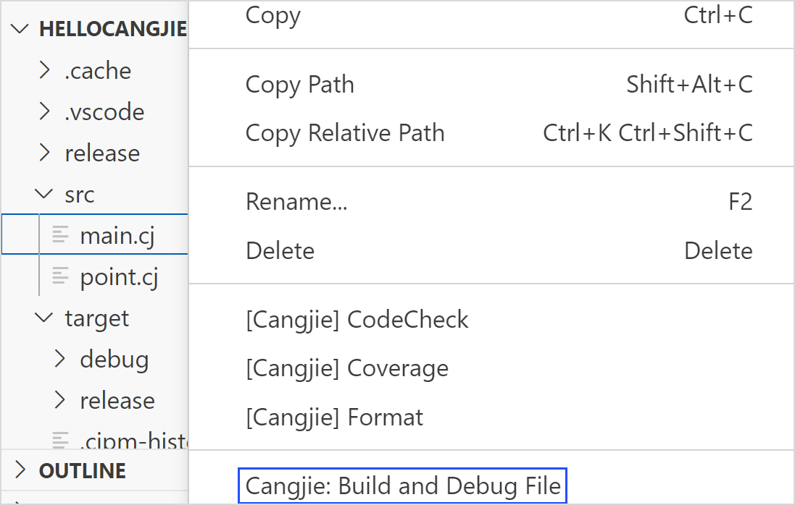

**调试手动编译的可执行文件**

  1. 使用 cjc 编译器或 cjpm 手动编译出可调试的二进制文件。
  2. 单击 Run and Debug > Cangjie\(cjdb\) Debug > Cangjie \(CJNative\): launch > Choose Executable File Later 启动调试。

**Launch debugMacro 模式仓颉工程调试宏展开后的代码**

调试宏展开后的代码文件（后缀为 `.marcocall`），此时宏对应的原文件无法调试。

**调试远程进程（支持 Linux 远程到 Linux）**

Launch 模式下调试远程进程时，调试服务会将本地编译的二进制文件推送到远程平台，然后调试远程平台的二进制文件。

  1. 在远程平台启动 lldb-server。建议使用 cjdb 自带的 lldb-server，路径为 /cangjie/third\_party/llvm/lldb/bin/lldb-server，启动命令 `/**/**/cangjie/third_party/llvm/lldb/bin/lldb-server p --listen "*:1234" --server`。
  2. 在本地机器使用 cjc 编译器或 cjpm 手动编译出可调试的二进制文件。
  3. 单击 Run and Debug 按钮启动调试。

`launch.json` 配置示例如下：
    
    __
    
    {
        "name": "Cangjie Debug (cjdb): test",
        "program": "/**/**/test",
        "request": "launch",
        "type": "cangjieDebug",
        "externalConsole": false,
        "remote": true,
        "remoteCangjieSdkPath": "/**/**/cangjie",
        "remoteFilePath": "/**/**/test",
        "remoteAddress": "127.0.0.1:1234",
        "remotePlatform": "remote-linux"
    }
    
**配置属性**

属性| 类型| 描述  
---|---|---  
program| string| 被调试进程的全路径，该文件将推送到远程平台，例如：/home/cangjieProject/build/bin/main  
remote| boolean| 启动远程 Launch 进程，remote 为 true  
remoteCangjieSdkPath| string| 远程平台仓颉 SDK 路径  
remoteFilePath| string| 远程平台存放推送文件的全路径，请确保路径 /home/test/ 合法且存在，`main` 为推送到远程的文件名，例如：/home/cangjieProject/build/bin/main  
remoteAddress| string| 被调试进程所在的机器 IP 和 lldb-server 监听的端口号，数据格式：ip:port  
remotePlatform| string| 远程的平台，仅支持 remote-linux（远程 Linux 平台）  
env| object| 为被调试程序设置运行时的环境变量，该配置将覆盖系统环境变量，如需在系统配置基础上追加配置，在配置项结尾增加 env:PATH。例如："PATH":"/home/user/bin:env:PATH。例如："PATH":"/home/user/bin:\{env:PATH\}", "LD\_LIBRARY\_PATH":"/home/user/bin:$\{env:LD\_LIBRARY\_PATH\}"。  
  
### Attach 模式

**调试本地进程**

  1. 在 `launch.json` 文件中单击 Add Configuration > Cangjie Debug \(CJNative\) : attach 添加调试配置，选择添加的配置启动调试。
  2. 在弹出界面选择要调试的进程即可启动调试。

**调试远程进程**

  1. 在本地机器编译出可调试二进制文件并将该文件拷贝到远程机器。
  2. 在远程机器启动 lldb-server，建议使用 cjdb 自带 lldb-server，路径为 /cangjie/third\_party/llvm/lldb/bin/lldb-server，启动命令 `/**/**/cangjie/third_party/llvm/lldb/bin/lldb-server p --listen "*:1234" --server`。
  3. 在远程机器启动被调试的二进制文件。
  4. 在本地机器配置 `launch.json` 文件，并启动调试。

`launch.json` 配置属性：
    
    __
    
    {
        "name": "Cangjie Debug (cjdb): test",
        "processId": "8888",
        "program": "/**/**/test",
        "request": "attach",
        "type": "cangjieDebug",
        "remote": true,
        "remoteAddress": "127.0.0.1:1234",
        "remotePlatform": "remote-linux"
    }
    
**配置属性**

属性| 类型| 描述  
---|---|---  
processId| string| 被调试进程的 pid（配置 pid 时优先 attach pid，未配置 pid 则 attach program）  
program| string| 被调试进程的全路径，例如：/home/cangjieProject/build/bin/main  
remote| boolean| attach 本机器进程，remote 为 false；若 attach 远程进程，将 remote 设置为 true  
remoteAddress| string| 远程调试时被调试进程所在的机器 IP 和 lldb-server 监听的端口号，数据格式：ip:port  
remotePlatform| string| 远程调试时远程的平台，仅支持 remote-linux（远程 linux 平台）  
  
## 查看调试信息

当进程处于 stopped 状态时，可以在 VSCode 界面左侧查看断点、当前线程、堆栈信息和变量，支持编辑断点和修改变量。也可以在 Editor 窗口将鼠标悬停在变量名称上方查看变量值。支持在 TERMINAL 窗口查看被调试程序的输出信息。

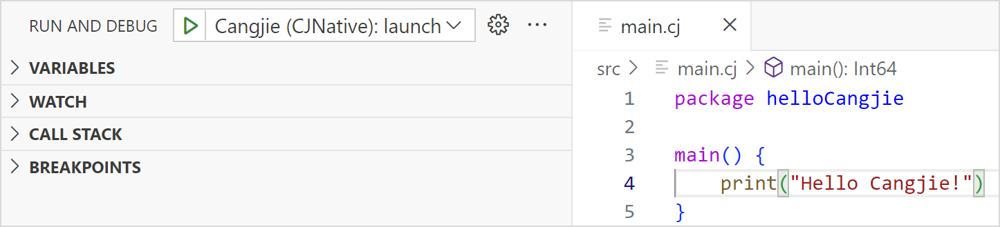

## 表达式求值

  * 在 WATCH 窗口添加按钮或空白处双击键入表达式。
  * 在 Debug Console 窗口键入表达式。
  * 在 Editor 窗口双击选中变量，右键选择 Evaluate in Debug Console。

## 程序控制

  * 单击顶部调试工具栏上的图标控制程序，包括单步执行、步入、步出、继续、暂停、重启或停止程序。

  * 在鼠标光标处单击右键选择 Run to Cursor。

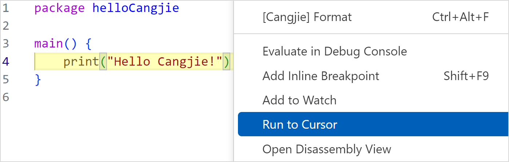

  * 在源码视图右键选择 Open Disassembly View 进入汇编视图。

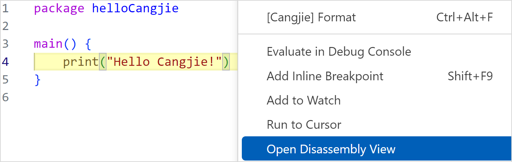

## 调试控制台

### 执行 cjdb 命令

在调试控制台中输入 cjdb 命令来调试程序，命令的格式需要以 `-exec` 开头，要执行的子命令必须是正确的 cjdb 命令。

使用 cjdb 命令 `n` 执行单步调试的示例如下：
    
    __
    
    -exec n

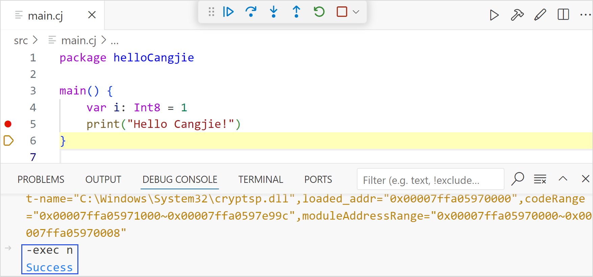

### 查看变量

在调试控制台中输入变量名称查看变量值：

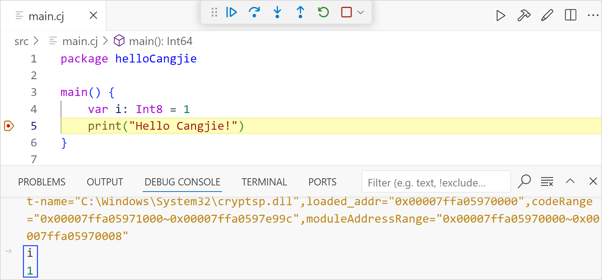

## 反向调试

> **说明：**
> 
>   * 反向调试基于记录重放，开启反向调试功能后，调试服务会记录开发者正向调试的所有停止点（断点 + 单步），以及停止点的线程、堆栈和变量等调试信息。进入反向调试模式，支持查看历史记录点的调试信息。
> 

### 配置

单击左下角齿轮图标，选择设置（Settings）选项，在搜索栏输入 cangjie，找到 Reverse Debug 选项，勾选 Enable reverse debug，开启程序调试历史停止点信息的自动记录。同时可以配置自动记录的线程个数、堆栈个数、变量作用域、复杂类型变量子变量的展开层数和子变量个数。修改配置后，需要重新启动仓颉调试。

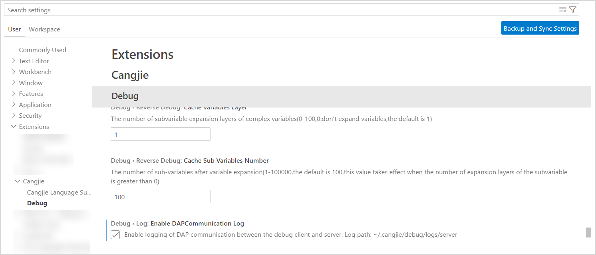

### 工具栏

单击顶部调试工具栏上的时钟图标进入反向调试模式，使用工具栏上正反向继续、正反向单步控制程序，查看历史记录的线程、堆栈、变量信息，如下图所示。

单击顶部调试工具栏上的方块图标退出反向调试模式，调试会回到正向调试的最后停止点，如下图所示。

### 反向断点

> **说明：**
> 
>   * 反向断点是一种特殊的源码断点（Log Point），正向调试过程中不会停止，也不会输出自动生成的 Log Message（用于标记反向断点）。
>   * 在正向调试时，开发者提前设置反向断点，调试服务后台会记录进程走过的反向断点的调试信息。
>   * 在进入反向调试模式时，反向断点会作为停止点（断点型），可以查看该断点处的线程堆栈变量等调试信息。
>   * 在进入反向调试模式时，不支持设置反向断点。
> 

反向断点设置方式：

  1. 在仓颉源文件编辑器视图内右键选择 Cangjie: Add Reverse Breakpoint，为光标所在行设置一个反向断点。

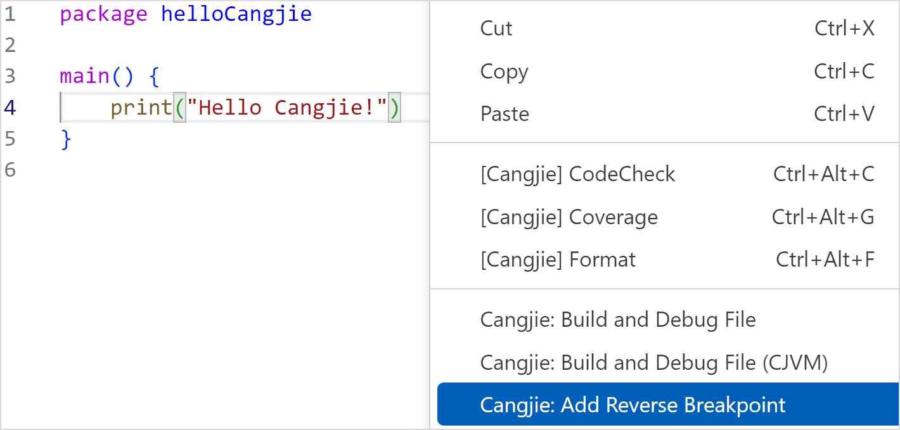

  2. 在仓颉源文件上右键选择 Cangjie: Add Auto Reverse Breakpoints 插件会分析该文件内函数的入口和出口位置并自动设置反向断点。

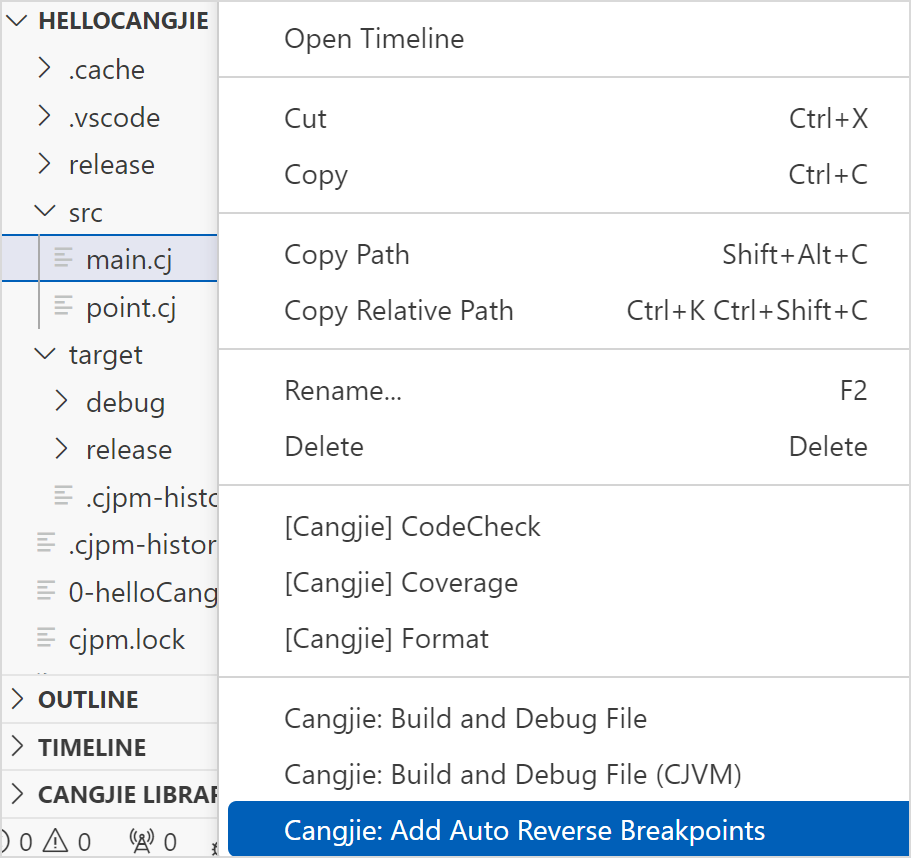

  3. 在文件夹上右键选择 Cangjie: Add Auto Reverse Breakpoints 插件会分析该文件夹内仓颉源文件中的函数的入口和出口位置并自动设置反向断点。

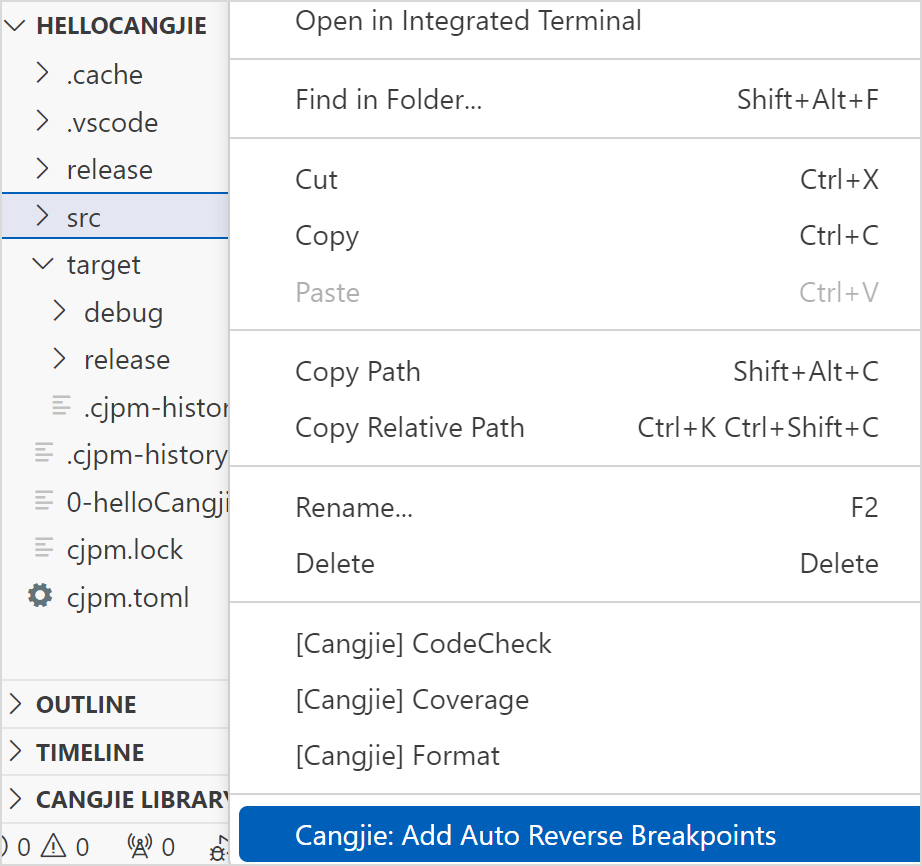

### 时间线

> **说明：**
> 
> 时间线展示了反向调试模式下记录的所有停止点（断点+单步），通过时间线拖拽，可以查看历史停止点的信息。

时间线入口位于 VSCode 右下方区域，可以在右下方的 Tab 标签行右键将时间线 Cangjie Debug Timeline 开启或隐藏，也可以在 View 菜单中选择 Open View 开启，如下图所示。

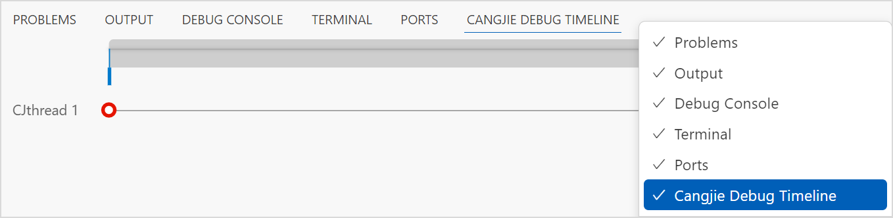

  1. 主时间线上有左右游标，可以分别拖动左右游标选出某一段时间区域。在选中一段区域之后，鼠标放在选中区域上方时会变为手的形状，此时可以左右拖动此区域。
  2. 将鼠标放在主时间线上，鼠标变为十字光标的形状，此时按住鼠标往前或往后拖动，可以将鼠标滑过的区域设为新的时间区域。
  3. 可以通过 Ctrl + 鼠标滚轮的方式，放大和缩小选中区域。
  4. 每条时间线标识一个仓颉线程或者系统线程。

单击时间线上的记录点，editor 界面同步刷新（定位到源码的行），调试信息界面同步刷新（展示该记录点的线程、栈帧和变量）。

## unittest 运行和调试

### 前置条件

模块的单元测试代码应采用如下结构，其中 `.cj` 文件表示包的源码，对应单元测试代码文件命名应以 `_test.cj` 结尾。具体单元测试代码的写法可参考标准库用户手册。
    
    __
    
    ├── src
    
    │    ├── koo
    
    │    │   ├── koo.cj
    
    │    │   └── koo_test.cj
    
    │    ├── zoo
    
    │    │   ├── zoo.cj
    
    │    │   └── zoo_test.cj
    
    │    ├── main.cj
    
    │    └── main_test.cj
    
    └── cjpm.toml

### 使用方式

  1. 单击 `@Test/@TestCase` 声明行上的 run 按钮，运行该单元测试类/单元测试 case。
  2. 单击 `@Test/@TestCase` 声明行上的 debug 按钮，调试该单元测试类/单元测试 case。

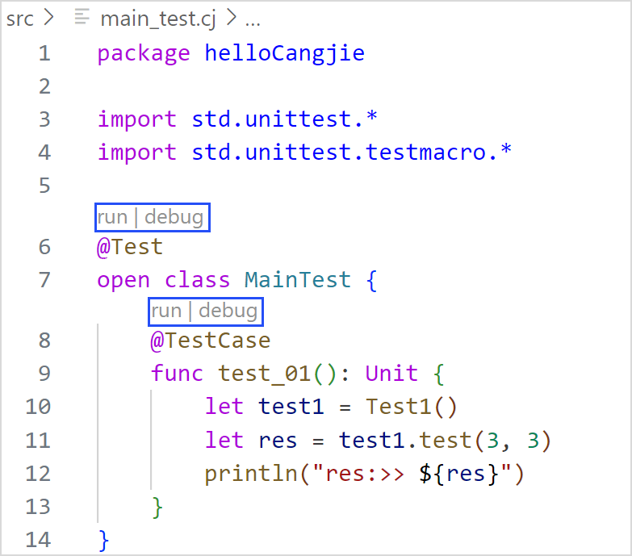

## DAP 通信日志

调试服务客户端和服务端采用 DAP 协议通信，通信日志可用于定位问题。日志路径在用户目录下 `/.cangjie/debug/logs/server`。

可以通过点击左下角齿轮图标，选择设置（Settings）选项，在搜索栏输入 cangjie，找到 Debug 选项，勾选 `Enable DAPCommunication Log`，开启调试服务通信日志。

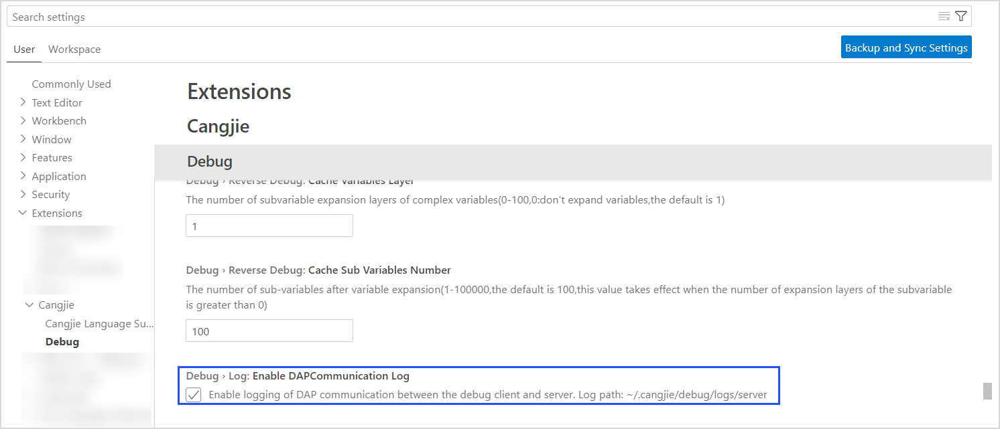